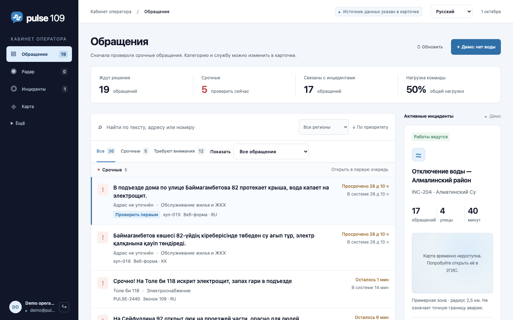
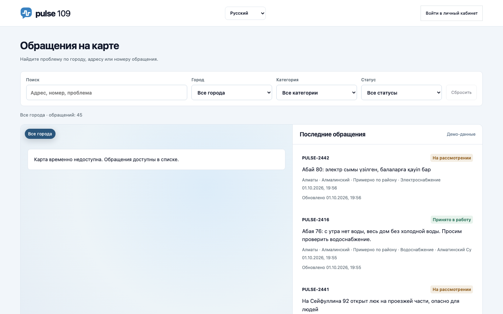
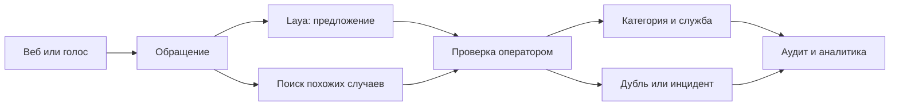

<div align="center">
  
  <h1>Pulse 109</h1>
  <p><strong>AI-assisted citizen request operations for Kazakhstan</strong></p>
  <p>Приём обращений, помощь оператору и ситуационная аналитика в одном приложении.</p>
  <p>
    <a href="#русский">Русский</a> ·
    <a href="#english">English</a> ·
    <a href="https://xy.govtech-kz.com">Live demo</a>
  </p>
  <p>
    
    
    
    
  </p>
</div>



## Русский

### Что такое Pulse 109

Pulse 109 — демонстрационная система для обработки обращений граждан. Она объединяет веб- и голосовой приём, очередь оператора, RU/KK-классификацию, поиск похожих решённых случаев, работу с дублями и инцидентами, карту, всплески, прогнозы и отчёты.

ИИ предлагает категорию, срочность и похожие случаи. Окончательное решение всегда подтверждает оператор. Каждое изменение сохраняется в журнале аудита.

### Как мы работали за кэмп

**Задача.** Собрать понятный сквозной сервис для обращений граждан: принять сообщение на русском или казахском, помочь оператору определить категорию и службу, найти похожие случаи, заметить массовый инцидент и показать проверяемую аналитику.

Мы двигались короткими вертикальными итерациями: сначала проверяли данные и ограничения, затем доводили один рабочий сценарий от обращения до решения, после этого подключали ML, карты, голос и аналитику. Каждую крупную функцию закрывали воспроизводимой проверкой, а решения ИИ оставляли под контролем оператора.

#### Команда и зоны ответственности

| Участник | Зона ответственности |
|---|---|
| Ильяс | Архитектура, backend и интеграция, ML-пайплайны, безопасность и выпуск |
| Ольга | Интерфейсы гражданина и оператора, тексты, UX и визуальное ревью |
| Нурали | QA, тестовые сценарии, проверка и аннотация данных |

#### Что сделали по неделям

| Неделя | Результат |
|---|---|
| **1 · 10–13 сентября** | Исследовали кейс и аналоги, проверили 1 036 858 строк исходных CSV, зафиксировали покрытие и ограничения данных. Собрали базовый FastAPI/SQLite-контур, очередь и сценарий уточнения обращения. |
| **2 · 24–25 сентября** | Довели основной путь `обращение → предложение ИИ → проверка оператором → решение`. Добавили приоритеты, похожие случаи, дубли, инциденты, Radar, Copilot, отслеживание статуса и операторские playbook-сценарии. |
| **3 · 26–28 сентября** | Построили воспроизводимое GPU-обучение Laya и multilingual similarity, добавили shadow-режим и guardrails. Реализовали авторизацию, карты, фото, приватное хранилище, RU/KK-голос, резервные сценарии, backup и health checks. |
| **4 · 29 сентября – 1 октября** | Завершили аналитику, PDF/XLSX-отчёты, citizen/operator UI, RU/KK/EN-локализацию, realtime operations и провайдеры Copilot. Провели OWASP ZAP-проверку, добавили CSP/HSTS, убрали inline JavaScript и улучшили контраст интерфейса. |

#### Статус сейчас

- Работает полный demo flow: обращение, классификация, поиск похожих случаев, подтверждение оператором, Radar/инцидент, прогноз и отчёт.
- Работают web- и voice-intake, кабинет оператора, публичная модерируемая карта, RU/KK/EN-интерфейс, авторизация, аудит и privacy-границы.
- Laya и multilingual similarity имеют воспроизводимые GPU evidence, но остаются помощниками оператора; национальная витрина использует явно помеченные синтетические данные.

#### Что впереди

- Развернуть последний security-коммит на публичном сервере и повторно проверить CSP/HSTS на live origin.
- Получить разрешённый размеченный holdout на реальных обращениях и подтвердить качество моделей вне синтетики.
- Провести пилот с операторами, измерить время и ошибки, затем принимать решение о production rollout.

### Основные возможности

| Модуль | Что он делает |
|---|---|
| Приём обращения | Веб- и голосовой сценарий, RU/KK/mixed, адрес, карта, фото и видео |
| Кабинет оператора | Приоритетная очередь, карточка обращения, уточнения и подтверждение решения |
| Laya | Предлагает категорию, срочность, необходимость уточнения и спам-сигнал |
| Similarity | Находит похожие решённые обращения и помогает проверить дубли |
| Radar и инциденты | Показывает всплески, связывает обращения и сохраняет исходные записи |
| Аналитика | 20 регионов в synthetic demo, прогноз на 1–3 месяца, RU/KK-вопросы |
| Отчёты | Экспорт проверенных агрегатов в PDF и XLSX |
| Безопасность | Авторизация, CSRF, серверные сессии, rate limit, CSP и HSTS |

### Интерфейс

| Кабинет оператора | Публичная карта |
|---|---|
| Приоритеты, очередь, инциденты и действия оператора | Только обращения с согласием и модерацией |
|  |  |

### Как работает обработка



### Быстрый запуск

Требуется Python 3.11+.

```sh
git clone https://github.com/BAITC-Hacks/hack-f15afa6b-xy.git
cd hack-f15afa6b-xy
python3 -m venv .venv
. .venv/bin/activate
pip install -r requirements.txt

DATABASE_PATH=/tmp/pulse109-demo.db \
P109_DEMO_MODE=1 \
P109_AUTH_DISABLED=1 \
python -m uvicorn app:app --host 127.0.0.1 --port 8769
```

Откройте [http://127.0.0.1:8769](http://127.0.0.1:8769). Флаги `P109_DEMO_MODE=1` и `P109_AUTH_DISABLED=1` разрешены только для локального demo на loopback.

### Проверка безопасности

1 октября 2026 года публичный сайт прошёл ограниченную пассивную проверку OWASP ZAP 2.17.0: 22 GET-запроса к точному origin, без входа в аккаунт, форм, загрузок, изменения данных и активных атак.

Проверка обнаружила два отсутствующих защитных заголовка. Оба исправлены в общем middleware, поэтому защита применяется к страницам, API, статическим файлам и ответам с ошибками.

| Результат проверки | Изменение |
|---|---|
| CSP отсутствовал на HTML-страницах | Добавлен `Content-Security-Policy`: только разрешённые скрипты, стили, карты, медиа и WebSocket; inline JavaScript удалён |
| HSTS отсутствовал на HTTPS-ответах | Добавлен `Strict-Transport-Security: max-age=31536000` для HTTPS |
| Низкий контраст зелёной кнопки | Цвет затемнён до уровня, подходящего для белого текста |

Это не означает, что система полностью защищена от всех классов атак. Пассивная проверка не охватывала авторизованные роли, IDOR/BOLA, активные injection-тесты, загрузки и бизнес-логику.

### Проверка проекта

```sh
python scripts/check_auth.py
python scripts/smoke.py
python scripts/check_demo.py
python scripts/check_privacy.py
python scripts/check_reports.py
python scripts/check_laya.py
python scripts/check_similarity.py
python scripts/check_copilot.py
```

### Данные и модели

- `synthetic_demo` содержит детерминированную демонстрацию для 20 регионов. Это не официальная статистика.
- `organizer` содержит пригодный временной срез только для 6 регионов; отсутствующие регионы не заменяются нулями.
- Laya и multilingual E5 обучались на GPU, но опубликованные метрики относятся к разделённым синтетическим наборам.
- Hosted OpenAI, private Qwen и deterministic fallback дают оператору черновик. Они не принимают окончательных решений.
- Реальные персональные данные, секреты и `.env` нельзя добавлять в Git.

Подробный технический статус: [`docs/handoff.md`](docs/handoff.md). Сценарий демонстрации и production runbook: [`docs/operations-delivery.md`](docs/operations-delivery.md).

---

## English

### What is Pulse 109?

Pulse 109 is a demonstration platform for citizen request operations. It combines web and voice intake, an operator queue, Russian/Kazakh classification, similar-case retrieval, duplicate and incident review, maps, surge detection, forecasts, and reports.

AI proposes categories, urgency, and related cases. A human operator confirms every decision, and the application records changes in an audit trail.

### How we worked during the camp

**Goal.** Build an understandable end-to-end service that accepts Russian and Kazakh citizen requests, helps an operator choose a category and responsible service, finds related cases, detects larger incidents, and presents auditable analytics.

We worked in short vertical iterations: validate the data and constraints, complete one working request-to-decision flow, then add ML, maps, voice, and analytics. Every major capability received a reproducible check, while final decisions remained with the operator.

#### Team responsibilities

| Team member | Responsibility |
|---|---|
| Ilyas | Architecture, backend and integration, ML pipelines, security, and release |
| Olga | Citizen and operator interfaces, copy, UX, and visual review |
| Nurali | QA, test scenarios, data review, and annotation |

#### Weekly progress

| Week | Result |
|---|---|
| **1 · 10–13 September** | Researched the case and comparable systems, audited 1,036,858 source CSV rows, and documented data coverage and limits. Built the initial FastAPI/SQLite foundation, queue, and clarification flow. |
| **2 · 24–25 September** | Completed the `request → AI proposal → operator review → decision` path. Added priorities, similar cases, duplicate review, incidents, Radar, Copilot, status tracking, and operator playbooks. |
| **3 · 26–28 September** | Built reproducible GPU training for Laya and multilingual similarity with shadow-mode guardrails. Added authentication, maps, media, private storage, RU/KK voice, fallbacks, backups, and health checks. |
| **4 · 29 September – 1 October** | Completed analytics, PDF/XLSX reports, citizen/operator UI, RU/KK/EN localization, realtime operations, and Copilot providers. Ran the OWASP ZAP assessment, added CSP/HSTS, removed inline JavaScript, and improved contrast. |

#### Current status

- The full demo flow works: intake, classification, similar-case retrieval, operator confirmation, Radar/incident review, forecasting, and reporting.
- Web and voice intake, the operator workspace, moderated public map, RU/KK/EN UI, authentication, audit trail, and privacy boundaries are implemented.
- Laya and multilingual similarity have reproducible GPU evidence but remain operator-assist tools; national demo analytics are explicitly synthetic.

#### Next steps

- Deploy the latest security commit to the public server and recheck CSP/HSTS on the live origin.
- Obtain an approved labeled holdout of real requests and validate model quality beyond synthetic data.
- Run an operator pilot, measure time and errors, and use the evidence to decide on production rollout.

### Core capabilities

| Area | Capability |
|---|---|
| Intake | Web and voice flows, RU/KK/mixed language, address, map, photo, and video |
| Operator workspace | Prioritized queue, case review, clarification, and confirmation |
| Laya | Category, urgency, clarification, and spam proposals |
| Similarity | Related resolved cases and duplicate review |
| Radar and incidents | Surge detection while preserving every original request |
| Analytics | 20-region synthetic demo, 1–3 month forecasts, RU/KK questions |
| Reporting | Validated PDF and XLSX aggregate exports |
| Security | Authentication, CSRF, server-side sessions, rate limits, CSP, and HSTS |

### Architecture

Pulse 109 uses one FastAPI application, SQLite, and a vanilla HTML/CSS/JavaScript interface. Model serving endpoints are optional and private. The main application remains usable through explicit fallbacks when GPU or hosted model providers are unavailable.

### Local setup

```sh
git clone https://github.com/BAITC-Hacks/hack-f15afa6b-xy.git
cd hack-f15afa6b-xy
python3 -m venv .venv
. .venv/bin/activate
pip install -r requirements.txt

DATABASE_PATH=/tmp/pulse109-demo.db \
P109_DEMO_MODE=1 \
P109_AUTH_DISABLED=1 \
python -m uvicorn app:app --host 127.0.0.1 --port 8769
```

Open [http://127.0.0.1:8769](http://127.0.0.1:8769). Authentication bypass and demo mode are restricted to local loopback demonstrations.

### Security assessment and remediation

On 1 October 2026, the public site received a bounded OWASP ZAP 2.17.0 passive assessment: 22 exact-origin GET requests, unauthenticated, with no form submissions, uploads, mutations, or active attacks.

The assessment found missing CSP and HSTS headers. This repository now applies a restrictive, application-compatible CSP to every response, removes inline JavaScript, and sends one-year HSTS on HTTPS responses. The end-to-end authentication check verifies these headers together with session storage, CSRF protection, role enforcement, logout revocation, generic login errors, and rate limiting.

The assessment was intentionally limited. It does not rule out authorization, IDOR/BOLA, injection, upload, or business-logic vulnerabilities outside the passive unauthenticated scope.

### Honest limits

- National analytics use deterministic synthetic data and are not government statistics.
- The organizer time series currently covers six regions.
- Published model metrics are synthetic validation evidence, not production accuracy on citizen requests.
- AI output is operator assistance; a human remains responsible for decisions.
- Secrets, `.env`, and real citizen records must stay outside Git.

See [`docs/handoff.md`](docs/handoff.md) for current technical status and [`docs/operations-delivery.md`](docs/operations-delivery.md) for the demo and production runbook.

---
